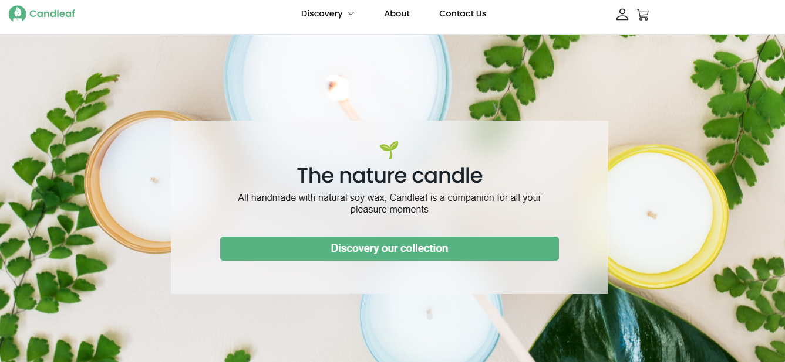
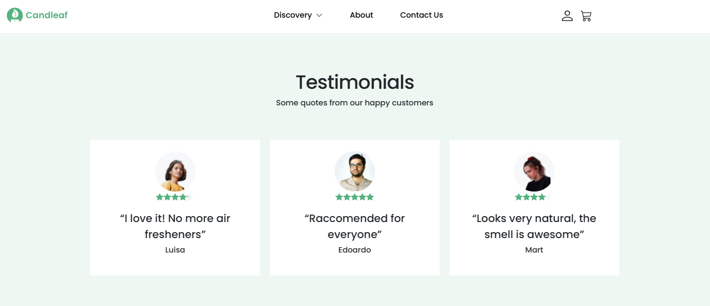
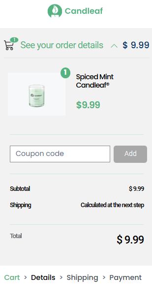

# Candleaf Ecommerce

O Candleaf Ecommerce foi um projeto/desafio proposto pelo **Programar com Você**,
visando a prática da tecnologia _react_ e ferramentas do ecossistema _frontend_ e
 seguindo o modelo de desenvolvimento _Mobile First_,
levando assim ao meu aperfeiçoamento hardskill enquanto desenvolvedora. 
Trata-se de um projeto de ecommerce para compra de produtos artesanais, 
incluindo o processo desde a exposição de itens até o processo de checkout
da compra. Com um design intuitivo e responsivo, essa aplicação visa
proporcionar uma navegação fluida e uma interface amigável ao usuário.

## Objetivos do projeto

- Permitir uma experiência de uma implementação completa, pois constrói um fluxo de e-commerce do início ao fim; 
- Favorecer um aprendizado contínuo, já que visa o aperfeiçoamento do conhecimento de tecnologias frontend;
- Estimular às práticas de demonstrações tecnológicas, já que permite uma maior interatividade e responsividade;
- Incentivar a introdução de novas tecnologias aos futuros projetos;
- Estimular a integração com plataformas de hospedagens, praticando deploy para acompanhamento do desenvolvimento do projeto no Vercel;
- Fomentar a prática de técnicas de desenvolvimento, como a _Mobile Fist_;
- Provocar boas práticas ao código, pois incentiva a constante codificação e organização dos arquivos.

## Deploy disponível

[**Candleaf Ecommerce**](https://candleaf-ecommerce-react.vercel.app/) no **Vercel**.

## Tecnologias Utilizadas

<div style="display: inline_block"><br>
  
  
  
  
  

</div><br>

- **HTML**: Para estruturação do conteúdo web.
- **CSS**: Visando a estilização e responsividade do layout.
- **Vite**: Para construção ágil e leveza do projeto.
- **React**: tornando a experiência do usuário mais interativa e eficiente.
- **Reactstrap**: Trata-se de uma biblioteca que oferece componentes clássicos do **Bootstrap** construídos em **React**.
  Para construção de interface e responsividade.

## Estratégias e Padrões de Desenvolvimento

- **Composição de Componentes**: Construção modular da interface com componentes React reutilizáveis, garantindo organização e manutenibilidade.
- **Design Responsivo**: Abordagem Mobile-First com CSS Grid e Flexbox, ajustando o layout para dispositivos móveis e desktop.
- **Gerenciamento de Estado com Hooks**: Utilização de React Hooks (`useState`, `useEffect`) para controle de estado de componentes dinâmicos.
- **Estilização com Styled Components**: Modularidade e especificidade nos estilos, facilitando manutenção e personalização do design.
- **Validação de Propriedades com PropTypes**: Assegura a tipagem correta de propriedades nos componentes, minimizando erros.
- **Funções Utilitárias**: Centralização de lógica comum em uma pasta `utils`, promovendo reutilização e clareza de código.
- **Controle de Erros e Feedback para o Usuário**: Exibição de mensagens de erro para interações como validação de formulário, melhorando a experiência do usuário.
- **Gerenciamento de Estados com Context API**: Uso de Context API para estados globais, facilitando a comunicação entre componentes.
- **Boas Práticas de Organização de Código**: Estrutura organizada em diretórios, com `components`, `pages`, e `assets`, promovendo escalabilidade.
- **Otimização de Carrosséis com Splide.js**: Biblioteca para exibição eficiente de produtos em carrossel, mantendo performance.
- **Gerenciamento de Rotas com React Router**: Controle de navegação fluido entre as páginas, com facilidade para expansão.
- **Deploy Contínuo com Vercel**: Pipeline de deploy contínuo para atualizações automáticas e acesso à versão mais recente.

## Design

O layout foi desenvolvido pensando na usabilidade e acessibilidade, com paletas de cores suaves e
elementos de navegação que priorizam a experiência do usuário. As telas foram desenhadas e
organizadas para destacar os produtos e facilitar o processo de compra.

[**Modelo Figma**](<https://www.figma.com/design/U9OuPfHUaouAjKIgRaubJi/E-Commerce-UI-KIT-(Community)-(my-Copy)?node-id=116-92&node-type=canvas&t=NJ9DqtPAjnvmo7nI-0>) fornecido pelo **Programar com Você** .

## Funcionalidades

- Navegação entre categorias de produtos e visualização de detalhes.
- Carrossel de produtos em destaque.
- Carrinho de compras com atualização automática de quantidade e preços.
- Sistema de checkout para finalizar a compra de produtos selecionados.

## A organização do site

### Repositório

O projeto segue a seguinte estrutura de pastas/arquivos:

```
candleaf-ecommerce-react/
├── public/
├── src/
│   ├── app/
│   ├── assets/
│   ├── components/
│   ├── context/
│   ├── db/
│   ├── layouts/
│   ├── routes/
│   ├── styles/ 
│   ├── utils/
│   ├── GlobalStyle.jsx
│   └── main.jsx
└── README.md
```

#### Rotas

1. `/` - Home: Apresenta produtos em destaque e categorias principais.
2. `/product/:id` - Detalhes do Produto: Página com detalhes, avaliações e opções de compra para o produto selecionado.
3. `/cart` - Carrinho de Compras: Visualiza os itens adicionados e permite a atualização de quantidade.
4. `/order` - Resumo do Pedido: exibe as informações gerais do pedido, como quantidade, subtotais, valores totais e possibilidade de desconto.
5. `/shipping` - Detalhes de envio: Aqui o usuário insere e seleciona detalhes relacionados ao local e a forma de envio dos produtos.
6. `/payment` - Pagamento: direciona o usuário para inserir os dados necessários para concluir a compra e resiva dados da compra.
7. `/confirmed` - Checkout: Realiza o processo de finalização do pedido, com a confirmação do pagamento.

### Seções

1. **Header e Navegação**: Inclui o logotipo e os links para navegação no site.
2. **Home**: Apresentação da página com direcionamento para vitrine de produtos.
3. **Products**: Vitrine de produtos.
4. **Clean and fragrant soy wax**: Detalhes de produtos destaques.
5. **Testimonials**: Depoimentos de quem já comprou o produto (Em carrossel na versão mobile).
6. **Popular**: Produtos em destaque ou em promoção.
7. **Footer**: Logo, links e direitos. 

### Telas

Aqui estão algumas visualizações de telas como demonstração do desenvolvimento realizado. 
Como são muitas telas, caso tenha interesse, poderá acessar o projeto no link
de deploy e/ou os prints disponíveis neste repositório. <br><br>


  <div style="display: flex; justify-content: center; flex-direction: column;">
    <div style="display: flex; justify-content: center; flex-direction: column;">
      <div align="center">
        <br>
        <em>Visualização da tela inicial via Web</em> 
      </div><br>
      <div align="center">
        <br>
        <em>Visualização da tela de depoimentos via Web</em> 
      </div><br>
    </div>
    <div align="center">
      <div style="display: flex; flex-direction: column;">
        <div>
          
          
          
        </div>
        <div>
          <em>Visualização de telas via Celular</em>
        </div>
      </div>
    </div>
  </div>

## Instalação e Execução

### Pré-requisitos

- Node.js (v14 ou superior)
- npm (v6 ou superior) ou yarn

### Passos para Instalação

1. Clone o repositório:

   ```bash
   git clone https://github.com/seu-usuario/seu-repositorio.git
   ```

2. Navegue até o diretório do projeto:

   ```bash
   cd seu-repositorio
   ```

3. Instale as dependências:

   ```bash
   npm install
   # ou
   yarn install
   ```

4. Execute o projeto:

   ```bash
   npm run dev
   # ou
   yarn dev
   ```

## Considerações Finais

Este projeto me ajudou de forma significativa a desenvolver habilidades práticas com React e outras ferramentas de frontend, como Vite, Splide, Reactstrap, de forma profissional e interativa. Enfrentar desafios como este me fazem crescer enquanto desenvolvedora 
e aprimorar as minhas habilidades de organização e adaptabilidade quanto aos diversos cenários de desenvolvimento, que neste caso 
foi uma proposta de *Mobile First*. Além disso, me instiga a cada vez mais deixar os projetos intuitivos e responsivos para os usuários. 

Assim como os demais projetos, este está aberto a sugestões e contribuições. Então, fique à vontade de sugerir melhorias e contribuir com novas funcionalidades e/ou correções de bugs. Afinal, treinando é que aprendemos, e em equipe somos bem melhores. 

## Agradecimentos 

* Ao **Programar com Você** pelo desafio proposto;
* A minha mentora [Mozaliza Loren](https://github.com/monalizaloren) por estar sempre me desafiando;
* Aos meus colegas de Squad do **Programar com Você** pelos feedbacks durante o desenvolvimento do projeto e as dailys.

## Contato

* LinkedIn: [https://www.linkedin.com/in/mirraely/](https://www.linkedin.com/in/mirraely/)
* GitHub: [https://github.com/mirraelly](https://github.com/mirraelly)
* Instagram: [https://www.instagram.com/mirraely__/](https://www.instagram.com/mirraely__/)

## Outras considerações

* Seguido o modelo do Figma disponibilizado pela Programar com Você.
* Desenvolvimento para fins didáticos.


